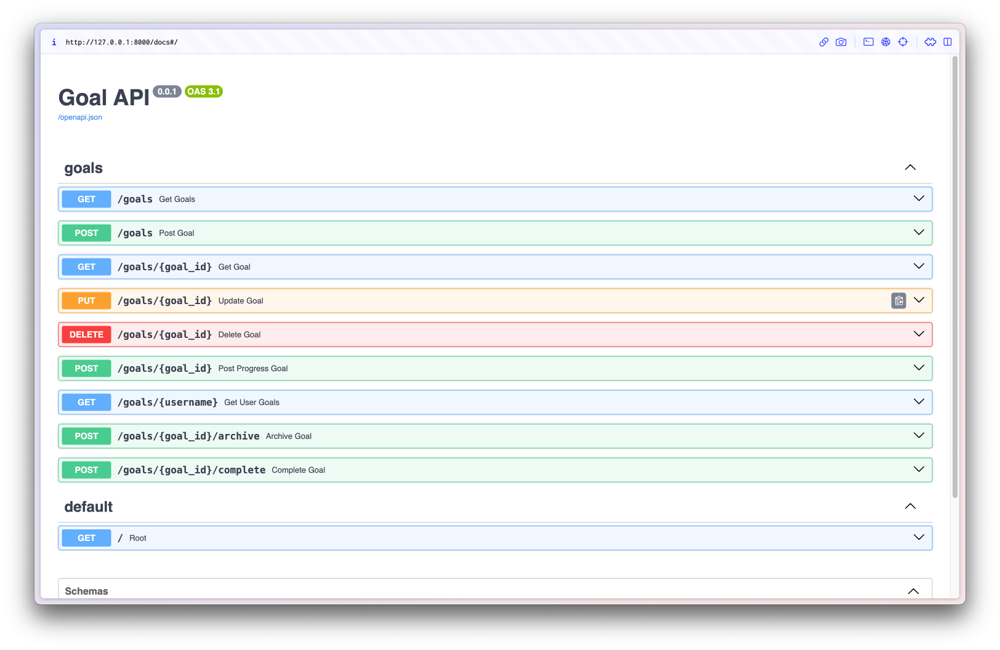

# Goals API Group 1 Non-Stationary - Winter 2023

## Description

This repository is a place for facilitating knowledge of Git and GitHub. It aims to show students various techniques that are used in a typical production setup. 

It's a pretty simple REST API for saving and sticking to goals, but not only goals like: “Learn python” or “Lose 5 kg”, additionally it can track habits etc. 

### Data Models


```python
Goal { 
    id: str,
    type: GoalType,
    title: str,
    description: str,
    progress: float
    archived: bool,
    completed: bool,
}


GoalType { 
    case habit
    case milestone
}
```

## Running steps:

## Create python venv (virtual environment):

```bash
python -m venv env
```

### Windows activation

```powershell
.\env\Scripts\Activate.ps1
```

### Linux activation

```bash
source ./env/bin/activate
```

## Download dependencies

```bash
pip install -r requirements.txt
```

## How to run the server

```bash
uvicorn app.main:app --reload
```

## How to operate 

As every fastAPI server there are few things to know: 
- when you go in browser or curl in terminal to the address on which the server started for instance: `http://127.0.0.1:8000 ` and add /docs to the path it will open swagger for your server. Something like this: 
